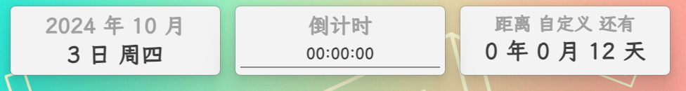
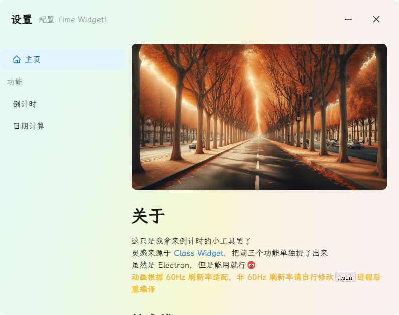

# time-widget

一个自用的倒计时小软件，UI / 灵感来源于 [RinLit-233-shiroko/Class-Widgets][1]

本软件开发过程中有使用 Copilot

默认动画根据 60Hz 刷新率计算，不同者可能需自行更改渲染进程和主进程代码

针对 Windows 构建，其他平台未做测试

需要注意，本软件 **不能多开**，会出现很多问题

使用本软件时，请关闭 **在标题栏和窗口边框上显示强调色**，当顶部窗口处于焦点时会造成样式错乱

在缩放高于 **100%** 的显示器上使用可能会有问题

## 架构

- Electron 作为框架

- Vite 作为构建工具

- Ant Design Vue 作为 UI 组件库

- Vue 3 作为前端框架

## 截图

顶部窗口

设置界面

[1]: https://github.com/RinLit-233-shiroko/Class-Widgets
