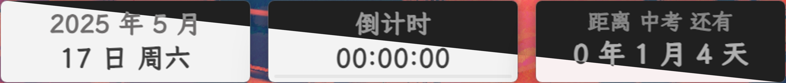
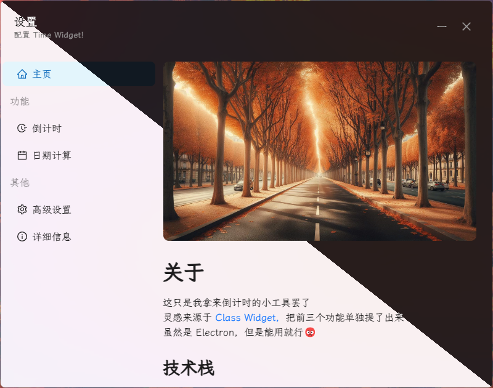

# time-widget

一个自用的倒计时小软件，UI / 灵感来源于 [RinLit-233-shiroko/Class-Widgets][1]

本软件开发过程中有使用 Copilot

针对 Windows 构建，其他平台未做测试

**重要：Windows 11 及以上版本体验更完整**

~~需要注意，本软件 **不能多开**~~

> 现在，多开的进程将会直接退出

使用本软件时，请关闭 **在标题栏和窗口边框上显示强调色**，当顶部窗口处于焦点时会造成样式错乱（也就是顶部多出来一个条带状的强调色块）

在缩放高于 **100%** 的显示器上使用**可能会有问题**~~（因为我也不确定）~~

## 架构

- Electron 作为框架

- Vite 作为构建工具

- Ant Design Vue 作为 UI 组件库

- Vue 3 作为前端框架

## 截图

顶部窗口（亮色 Mica \ 暗色 Mica）

设置界面（亮色 Mica \ 暗色 Mica）

[1]: https://github.com/RinLit-233-shiroko/Class-Widgets
